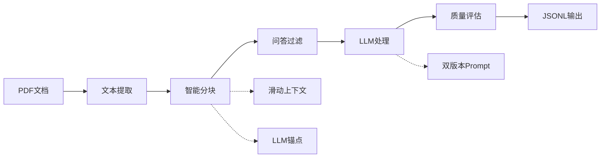

# 🔍 Legend QA Extractor

<div align="center">

[](https://www.python.org/downloads/)
[](LICENSE)
[](https://github.com/psf/black)

**基于本地大模型的专业PDF问答对提取工具**

*将您的PDF文档转换为结构化的问答数据集，专为AI训练和知识管理而设计*

[English](README_EN.md) • [中文文档](README_CN.md)

</div>

---

## ✨ 核心特性

🤖 **本地大模型集成**
- 使用 Ollama 配合 Qwen2.5 等先进模型
- 完全本地化处理，确保数据隐私安全
- 支持多种模型规格，从 7B 到 14B 参数

📄 **智能PDF处理**
- 高精度PDF文本提取与预处理
- 智能文本分块算法 (SmartBlockProcessor)
- 自适应块大小调整和质量保障

🎯 **高级问答识别**
- 多模式问答格式识别（直接提问、文章引用、间接问题等）
- 智能双版本prompt机制，自动优化token使用
- 上下文感知的滑动窗口技术

⚙️ **灵活配置系统**
- YAML配置文件 + 环境变量 + 命令行参数
- 实时配置验证和智能默认值
- 完整的参数文档和最佳实践指南

🔧 **开发者友好**
- 模块化架构，易于扩展和维护
- 完整的类型提示和文档字符串
- 全面的单元测试覆盖

📊 **质量监控**
- 内置提取质量评估指标
- 详细的处理日志和错误追踪
- Token使用监控和优化建议

## 🔄 工作原理



### 处理流程详解

1. **PDF解析**: 使用 PyMuPDF 进行高质量文本提取
2. **智能分块**: SmartBlockProcessor 进行结构化文本分割
3. **上下文增强**: 滑动窗口和LLM生成的主题锚点
4. **问答识别**: 多模式匹配和智能过滤
5. **LLM提取**: 自适应prompt选择和token优化
6. **质量保障**: 结果验证和评分机制

## 🚀 快速开始

### 环境要求

- **Python**: 3.8 或更高版本
- **Ollama**: 已安装并运行 ([安装指南](https://ollama.ai/))
- **模型**: 推荐 `qwen2.5:7b-instruct` 或更高版本
- **系统**: macOS、Linux 或 Windows

### 安装步骤

```bash
# 1. 克隆项目
git clone https://github.com/yourusername/legend-qa-extractor.git
cd legend-qa-extractor

# 2. 自动环境设置（推荐）
chmod +x scripts/setup_environment.sh
./scripts/setup_environment.sh

# 3. 或手动设置
python -m venv venv
source venv/bin/activate  # Windows: venv\Scripts\activate
pip install -r requirements.txt

# 4. 拉取推荐模型
ollama pull qwen2.5:7b-instruct
```

### 基础使用

```bash
# 提取问答对
python extract_qa.py your_document.pdf

# 快速测试（处理10%内容）
python extract_qa.py document.pdf --sample 0.1

# 使用自定义配置
python extract_qa.py document.pdf --config my_config.yaml

# 创建配置模板
python extract_qa.py --create-config

# 验证环境设置
python extract_qa.py --validate
```

## ⚙️ 配置系统

### 配置文件示例

```yaml
# config/config.yaml
# 基础设置
pdf_filename: "document.pdf"
output_filename: "extracted_qa.jsonl"
output_dir: "output"

# 模型配置
model_name: "qwen2.5:7b-instruct"
ollama_host: "http://localhost:11434"
temperature: 0.1

# 处理参数
max_block_size: 1500
min_block_size: 200
extract_ratio: 1.0
enable_qa_filter: false

# 高级功能
enable_sliding_context: true
enable_llm_anchor: true
anchor_keywords_count: 2

# 监控和日志
log_level: "INFO"
enable_token_monitoring: true
```

### 环境变量支持

```bash
export PDF_FILENAME="your_document.pdf"
export OLLAMA_MODEL="qwen2.5:14b-instruct"
export MAX_BLOCK_SIZE=2000
export EXTRACT_RATIO=0.5
export LOG_LEVEL="DEBUG"
```

### 命令行选项

```bash
python extract_qa.py [PDF_FILE] [OPTIONS]

主要选项:
  --config CONFIG           指定YAML配置文件
  --output OUTPUT           输出JSONL文件路径
  --model MODEL            Ollama模型名称
  --sample RATIO           采样比例 (0.0-1.0)
  --max-block-size SIZE    最大文本块大小
  --enable-qa-filter       启用问答块过滤
  --temperature TEMP       模型温度参数
  --log-level LEVEL        日志级别
  --validate               仅验证配置
  --create-config          创建配置模板
```

## 📁 项目结构

```
legend-qa-extractor/
├── src/                        # 核心源代码
│   ├── config/                 # 配置管理
│   │   ├── __init__.py
│   │   └── settings.py         # 配置类和验证
│   ├── core/                   # 核心处理模块
│   │   ├── pdf_processor.py    # PDF文本提取
│   │   ├── text_processor.py   # 文本预处理和分块
│   │   ├── qa_extractor.py     # 问答对提取引擎
│   │   ├── llm_client.py       # Ollama客户端
│   │   └── smart_block_processor.py # 智能分块处理器
│   ├── utils/                  # 工具函数
│   │   ├── file_utils.py       # 文件操作
│   │   └── logger.py           # 日志系统
│   └── processor.py            # 主处理流程
├── config/                     # 配置文件
│   └── config.yaml            # 默认配置
├── docs/                       # 文档
│   ├── PROMPT_SELECTION_GUIDE.md
│   └── TOKEN_OPTIMIZATION_GUIDE.md
├── examples/                   # 使用示例
├── tests/                      # 测试套件
├── scripts/                    # 工具脚本
├── extract_qa.py              # CLI入口点
└── output/                    # 输出目录
```

## 🎯 使用示例

### 命令行使用

```bash
# 基础提取
python extract_qa.py interview.pdf

# 高质量提取（使用大模型）
python extract_qa.py document.pdf \
  --model qwen2.5:14b-instruct \
  --temperature 0.05 \
  --enable-qa-filter

# 批量测试
python extract_qa.py large_document.pdf \
  --sample 0.2 \
  --max-block-size 2000 \
  --output test_results.jsonl
```

### 编程接口

```python
from src.config import Config
from src.processor import QAExtractionProcessor

# 创建配置
config = Config()
config.pdf_filename = "document.pdf"
config.model_name = "qwen2.5:7b-instruct"
config.enable_sliding_context = True
config.enable_llm_anchor = True

# 初始化处理器
processor = QAExtractionProcessor(config)

# 验证环境
validation = processor.validate_setup()
if validation['valid']:
    # 处理文档
    results = processor.process_pdf()
    print(f"提取了 {results['stats']['qa_pairs_extracted']} 个问答对")
    print(f"输出文件: {results['output_path']}")
else:
    print("环境验证失败:", validation['issues'])
```

### 自定义配置示例

```python
# 访谈录音转录的优化配置
config = Config()
config.known_prefixes = ["面试官", "候选人", "主持人", "嘉宾"]
config.max_block_size = 2500
config.enable_qa_filter = True
config.temperature = 0.02
config.enable_sliding_context = True

# 学术论文的配置
config = Config()
config.known_prefixes = ["问题", "回答", "Q", "A"]
config.max_block_size = 1200
config.enable_llm_anchor = True
config.anchor_keywords_count = 3
```

## 📊 输出格式

工具生成结构化的JSONL格式文件，每行包含一个问答对：

```json
{
  "question": "什么是价值投资的核心原则？",
  "answer": "价值投资的核心原则是买股票就是买公司。当你买入一家公司的股票时，你实际上是在购买这家公司的一部分所有权。因此，重要的是要了解这家公司的业务模式、财务状况和长期前景。",
  "source_text": "网友：什么是价值投资的核心原则？\n段永平：价值投资的核心原则是买股票就是买公司..."
}
```

### 质量指标

每次处理后会生成质量报告：

```json
{
  "extraction_quality": {
    "total_blocks_processed": 45,
    "qa_pairs_extracted": 28,
    "extraction_rate": 0.62,
    "average_question_length": 15.2,
    "average_answer_length": 125.8,
    "quality_score": 8.7
  }
}
```

## 🔧 高级功能

### 智能Prompt选择

系统根据文本长度自动选择最适合的prompt版本：

- **完整版**: 详细的提取规则和示例（≤1500字符时使用）
- **精简版**: 核心指令，节省token空间（>1500字符时使用）

### 智能文本分块

SmartBlockProcessor提供四层处理策略：

1. **结构化分块**: 基于段落、标题和问答标记
2. **自适应合并**: 智能合并小块，优化处理效率
3. **质量保障**: 过滤无效块，确保处理质量
4. **元数据增强**: 生成上下文和主题锚点

### Token监控

实时监控和优化token使用：

```bash
📊 Token使用报告
==================================================
📝 Prompt使用统计:
   精简版: 15 次 (60%)
   完整版: 10 次 (40%)
🎯 Token使用统计:
   平均利用率: 68.5%
   最高使用: 3,245 tokens
   最低使用: 1,892 tokens
⚡ 性能指标:
   处理速度: 2.3 块/分钟
   平均响应时间: 8.7秒
🟢 Token利用率健康
```

## 🛠️ 开发指南

### 设置开发环境

```bash
# 安装开发依赖
pip install -r requirements-dev.txt

# 设置pre-commit hooks
pre-commit install

# 运行测试
pytest tests/ -v --cov=src

# 代码格式化
black src/ tests/
isort src/ tests/

# 类型检查
mypy src/
```

### 运行测试

```bash
# 基础测试
pytest tests/

# 包含覆盖率报告
pytest tests/ --cov=src --cov-report=html

# 仅运行快速测试
pytest tests/ -m "not slow"

# 集成测试
pytest tests/ -m integration
```

### 自定义扩展

项目采用模块化设计，易于扩展：

```python
# 自定义文本处理器
class CustomTextProcessor(TextProcessor):
    def preprocess_qa_text(self, text: str) -> str:
        # 添加自定义预处理逻辑
        return super().preprocess_qa_text(text)

# 自定义问答提取器  
class CustomQAExtractor(QAExtractor):
    def create_prompt(self, text_block: str) -> str:
        # 自定义prompt生成逻辑
        return f"自定义指令:\n{text_block}"
```

## 📚 文档资源

- **[Prompt选择指南](docs/PROMPT_SELECTION_GUIDE.md)**: 详细的prompt机制说明
- **[Token优化指南](docs/TOKEN_OPTIMIZATION_GUIDE.md)**: Token使用优化技巧
- **[API文档](docs/api.md)**: 完整的API参考

## 🔍 故障排除

### 常见问题

**Q: Ollama连接失败**
```bash
# 检查Ollama服务状态
ollama list
curl http://localhost:11434/api/tags

# 重启Ollama服务
ollama stop && ollama start
```

**Q: 模型下载慢**
```bash
# 使用镜像加速
export OLLAMA_HOST=https://your-mirror.com
ollama pull qwen2.5:7b-instruct
```

**Q: 内存不足**
```bash
# 减小块大小和采样比例
python extract_qa.py document.pdf --max-block-size 800 --sample 0.5
```

**Q: 提取质量不佳**
```bash
# 启用高质量模式
python extract_qa.py document.pdf \
  --model qwen2.5:14b-instruct \
  --temperature 0.05 \
  --enable-qa-filter \
  --enable-sliding-context
```

### 日志分析

启用详细日志来诊断问题：

```bash
python extract_qa.py document.pdf --log-level DEBUG
```

查看输出目录中的日志文件：
- `main.log`: 主要处理日志
- `extraction_success_final.log`: 成功提取的记录
- `extraction_errors_final.log`: 错误和警告

## 🤝 贡献指南

我们欢迎社区贡献！请参考以下步骤：

1. **Fork** 项目到您的GitHub账户
2. **创建** 特性分支: `git checkout -b feature/amazing-feature`
3. **提交** 您的更改: `git commit -m 'Add amazing feature'`
4. **推送** 到分支: `git push origin feature/amazing-feature`
5. **创建** Pull Request

### 贡献类型

- 🐛 Bug修复
- ✨ 新功能
- 📚 文档改进
- 🧪 测试用例
- 🎨 代码优化

### 开发规范

- 遵循 PEP 8 代码风格
- 添加适当的类型提示
- 编写单元测试
- 更新相关文档

## 📄 许可证

本项目采用 [MIT License](LICENSE) 开源协议。

```
MIT License

Copyright (c) 2025 souflex56

Permission is hereby granted, free of charge, to any person obtaining a copy
of this software and associated documentation files (the "Software"), to deal
in the Software without restriction, including without limitation the rights
to use, copy, modify, merge, publish, distribute, sublicense, and/or sell
copies of the Software, and to permit persons to whom the Software is
furnished to do so, subject to the following conditions:

The above copyright notice and this permission notice shall be included in all
copies or substantial portions of the Software.
```

## 🙏 致谢

- **Ollama Team**: 提供优秀的本地大模型服务
- **Qwen Team**: 提供高质量的中文语言模型
- **PyMuPDF**: 强大的PDF处理库
- **Open Source Community**: 各种依赖库的维护者

## 📞 支持与联系

- **GitHub Issues**: [报告问题](https://github.com/yourusername/legend-qa-extractor/issues)
- **GitHub Discussions**: [技术讨论](https://github.com/yourusername/legend-qa-extractor/discussions)
- **Email**: support@legendqa.com

---

<div align="center">

**⭐ 如果这个项目对您有帮助，请给我们一个Star！**

[⬆ 回到顶部](#-legend-qa-extractor)

</div> 