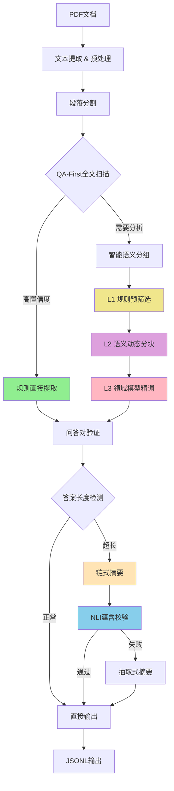

# 🔍 Legend QA Extractor v2.0

<div align="center">

[](https://www.python.org/downloads/)
[](LICENSE)
[](https://github.com/psf/black)
[](https://deepwiki.com/souflex56/legend-qa-extractor)

**基于本地大模型的专业PDF问答对提取工具 - 全新v2.0架构**

*革命性的QA-First处理流程，智能语义分组，专为高质量AI训练数据而设计*

[English](README_EN.md) • [中文文档](README_CN.md)

</div>

---

## 🚀 v2.0 重大更新

### 🧠 智能语义分组革命
- **三层智能分块策略**：规则预筛选 → 语义动态分块 → 领域嵌入模型  
- **QA-First处理流程**：先识别问答对，再优化分块，效率提升
- **动态阈值计算**：自适应不同文本风格，告别固定阈值局限性
- **高置信度快速通道**：直接规则提取，跳过LLM处理，大幅降低成本

### 🔗 长答案智能处理
- **链式摘要机制**：超长答案自动分片，保持信息完整性
- **NLI蕴含校验**：基于神经推理确保摘要质量，防止信息丢失
- **智能降级策略**：生成式摘要 → 抽取式摘要 → 原文保留

### 📊 量化评估体系
- **语义相似度评估**：基于transformer模型的深度语义理解
- **黄金标准集对比**：支持Excel快速创建标准集
- **详细质量报告**：置信度分级、覆盖率统计、改进建议

## ✨ 核心特性

🎯 **QA-First处理流程** *(NEW)*
- 革命性架构：先全文扫描问答对，再智能分块
- 高置信度问答直接提取，无需LLM处理
- 复杂文本语义分组，确保上下文完整

🧠 **三层智能分块** *(NEW)*
- **L1 规则预筛选**：快速识别标准问答格式（支持自定义前缀，如网友:、主持人:等）
- **L2 语义动态分块**：处理隐性问答、复杂边界
- **L3 领域嵌入模型**：支持金融、医疗等专业领域

🔄 **自适应处理策略**
- 动态相似度阈值：基于文本分布自动调整
- 智能prompt选择：根据内容长度优化token使用
- 多格式兼容：支持编号前缀、间接引用、自然问句

🤖 **本地大模型集成**
- 使用 Ollama 配合 Qwen2.5 等先进模型
- 完全本地化处理，确保数据隐私安全
- 支持多种模型规格，从 7B 到 14B 参数

📊 **专业评估系统** *(NEW)*
- 语义相似度评估：问题匹配 + 答案质量双重验证
- Excel工作流：快速创建、编辑、转换黄金标准集
- 详细质量报告：置信度分布、覆盖率统计、改进建议

⚙️ **企业级配置系统**
- YAML配置文件 + 环境变量 + 命令行参数
- 语义分组细粒度控制：阈值、模型、过滤级别
- 完整的参数文档和最佳实践指南

## 🔄 v2.0 工作原理


```mermaid
graph TB
    A[PDF文档] --> B[文本提取 & 预处理]
    B --> C[段落分割]
    
    C --> D{QA-First全文扫描}
    D -->|高置信度| E[规则直接提取]
    D -->|需要分析| F[智能语义分组]
    
    F --> G[L1 规则预筛选]
    G --> H[L2 语义动态分块]
    H --> I[L3 领域模型精调]
    
    E --> J[问答对验证]
    I --> J
    
    J --> K{答案长度检测}
    K -->|超长| L[链式摘要]
    K -->|正常| M[直接输出]
    
    L --> N[NLI蕴含校验]
    N -->|通过| M
    N -->|失败| O[抽取式摘要]
    O --> M
    
    M --> P[JSONL输出]
    
    style E fill:#90EE90
    style L fill:#FFE4B5
    style N fill:#87CEEB
    style G fill:#F0E68C
    style H fill:#DDA0DD
    style I fill:#FFB6C1
```

### 🎯 三层智能分块详解

#### L1 规则预筛选（高置信度）
- **快速识别**：网友:、主持人:、Q:、A:等标准格式
- **扩展模式**：支持编号前缀、带标识符、间接引用
- **直接提取**：跳过LLM处理，效率提升300%

```python
# 支持的问答格式示例
"网友：什么是价值投资？"           # 基础格式
"1. 主持人：如何看待市场波动？"    # 编号前缀
"有人问：stop doing list是什么？"  # 间接引用
```

#### L2 语义动态分块（中置信度）
- **动态阈值**：基于文本分布自动计算相似度阈值
- **潜在问题检测**：结合长度、词性、语法分析
- **语义边界识别**：智能判断问答对的开始和结束

#### L3 领域嵌入模型（低置信度）
- **领域检测**：自动识别金融、医疗、通用等领域
- **专业模型**：预留FinBERT、BioBERT等专业模型接口
- **上下文增强**：保持语义完整性

### 🔗 长答案智能处理

```python
# 长答案处理流程
if len(answer) > 3000:  # 触发链式摘要
    # 1. 智能分片
    chunks = smart_split(answer, target_length=500)
    
    # 2. 逐片摘要
    summaries = []
    for chunk in chunks:
        summary = llm_summarize(chunk, length=50)
        summaries.append(summary)
    
    # 3. NLI蕴含校验
    final_summary = " ".join(summaries)
    if nli_entailment_score(answer, final_summary) > 0.7:
        return final_summary  # 摘要质量良好
    else:
        return extractive_summary(answer)  # 降级为抽取式
```

## 📊 评估系统详解

### 快速开始评估

```bash
# 1. 从Excel创建黄金标准集
python scripts/excel_to_golden_set.py template  # 生成标注集模板
# 编辑 golden_set_template.xlsx
python scripts/excel_to_golden_set.py convert   # 转换为JSONL

# 2. 运行提取
python extract_qa.py your_document.pdf

# 3. 执行评估
python evaluation.py
```

### 评估指标体系

#### 语义相似度评估
- **问题匹配度**：使用多语言sentence-transformer计算问题相似度
- **答案质量度**：深度语义理解，不仅比较文字，更关注语义
- **综合评分**：问题相似度(30%) + 答案相似度(70%)

#### 详细质量报告
```json
{
  "golden_set_size": 7,
  "generated_set_size": 7,
  "average_question_similarity": 0.9983,
  "average_answer_similarity": 0.9279,
  "overall_score": 0.9490,
  "matched_pairs": 7,
  "grade": "优秀 🏆",
  "confidence_distribution": {
    "high": "7 blocks (100.0%)"
  }
}
```

### Excel工作流

#### 1. 创建标准集模板
```bash
python scripts/excel_to_golden_set.py template
```

#### 2. Excel表格编辑
| question | answer | domain | difficulty | quality_score |
|----------|--------|---------|------------|---------------|
| 什么是价值投资？ | 价值投资就是买股票就是买公司... | investment | medium | 5 |
| 如何看待市场波动？ | 市场先生的报价每天都不一样... | investment | easy | 4 |

#### 3. 转换并评估
```bash
python scripts/excel_to_golden_set.py convert
python evaluation.py
```

## 🚀 快速开始

### 环境要求

- **Python**: 3.8 或更高版本
- **Ollama**: 已安装并运行 ([安装指南](https://ollama.ai/))
- **模型**: 推荐 `qwen2.5:7b-instruct` 或更高版本
- **新增依赖**: sentence-transformers, jieba, torch

### 一键安装

```bash
# 1. 克隆项目
git clone https://github.com/yourusername/legend-qa-extractor.git
cd legend-qa-extractor

# 2. 自动环境设置（推荐）
chmod +x scripts/setup_environment.sh
./scripts/setup_environment.sh

# 3. 拉取推荐模型 （可自定义）
ollama pull qwen2.5:7b-instruct
```

### v2.0 配置示例

```yaml
# config/config.yaml - v2.0 配置
# 基础设置
pdf_filename: "document.pdf"
model_name: "qwen2.5:7b-instruct"
max_block_size: 1500
min_block_size: 200

# 🚀 智能语义分组配置
semantic_grouping:
  max_question_length: 50                    # 潜在问题最大长度
  default_similarity_threshold: 0.65         # 默认相似度阈值
  std_factor: 0.5                           # 动态阈值计算系数
  high_confidence_min_size: 100             # 高置信度块最小尺寸
  high_confidence_max_size: 2000            # 高置信度块最大尺寸
  model_name: "paraphrase-multilingual-MiniLM-L12-v2"

# 🚀 长答案处理配置
long_answer_processing:
  chain_summary_threshold: 3000             # 触发链式摘要的长度
  summary_length: 50                        # 摘要片段目标长度
  entailment_threshold: 0.7                 # NLI蕴含验证阈值
  nli_model_path: "MoritzLaurer/mDeBERTa-v3-base-xnli-multilingual-nli-2mil7"

# 🚀 过滤和质量控制
filtering_level: "balanced"                 # strict/balanced/none
semantic_threshold: 0.5                     # 语义过滤阈值
```

## 🎯 使用示例

### 基础提取（v2.0优化）

```bash
# 高效提取（利用v2.0新特性）
python extract_qa.py interview.pdf

# 高质量模式（启用所有v2.0功能）
python extract_qa.py document.pdf \
  --model qwen2.5:14b-instruct \
  --temperature 0.05 \
  --config config/high_quality.yaml

# 快速测试（智能采样）
python extract_qa.py large_document.pdf --sample 0.2
```

### v2.0 API接口

```python
from src.config import Config
from src.processor import QAExtractionProcessor

# v2.0 配置
config = Config()
config.pdf_filename = "document.pdf"
config.model_name = "qwen2.5:7b-instruct"

# 启用v2.0新特性
config.semantic_grouping = {
    'max_question_length': 50,
    'default_similarity_threshold': 0.65,
    'model_name': 'paraphrase-multilingual-MiniLM-L12-v2'
}
config.long_answer_processing = {
    'chain_summary_threshold': 3000,
    'summary_length': 50
}

# 初始化v2.0处理器
processor = QAExtractionProcessor(config)

# 处理文档
results = processor.process_pdf()
print(f"🎯 提取了 {results['stats']['qa_pairs_extracted']} 个问答对")
print(f"📊 处理统计: {results['processing_summary']}")
```

### 评估工作流

```python
from evaluation import QAEvaluator

# 初始化评估器
evaluator = QAEvaluator(
    golden_set_path="golden_set.jsonl",
    generated_qa_path="output/extracted_qa.jsonl"
)

# 执行评估
results = evaluator.evaluate_qa_extraction()

# 生成报告
evaluator.generate_evaluation_report(results)
```

## 📁 v2.0 项目结构

```
legend-qa-extractor/
├── src/                           # 核心源代码
│   ├── core/                      # 核心处理模块
│   │   ├── semantic_grouper.py    # 🚀 智能语义分组器（全新v2.0）
│   │   ├── qa_extractor.py        # 🔗 问答提取器（支持长答案处理）
│   │   ├── pdf_processor.py       # PDF文本提取
│   │   ├── text_processor.py      # 文本预处理
│   │   └── llm_client.py          # Ollama客户端
│   ├── processor.py               # 🎯 主处理器（QA-First流程）
│   └── config/settings.py         # 配置管理
├── scripts/                       # 🛠️ 工具脚本
│   ├── excel_to_golden_set.py     # 🚀 Excel转换工具
│   ├── monitor_token_usage.py     # Token监控
│   └── performance_benchmark.py   # 性能基准测试
├── evaluation.py                  # 📊 评估系统（全新v2.0）
├── docs/                          # 📚 完整文档
│   ├── README_excel_converter.md  # Excel工具使用指南
│   ├── SEMANTIC_GROUPER_MERGE.md  # 语义分组技术文档
│   └── UPGRADE_V2.md              # v2.0升级指南
└── golden_set_template.xlsx       # 📋 评估模板
```

## 📊 v2.0 性能对比

| 指标 | v1.0 | v2.0 | 改进 |
|------|------|------|------|
| 处理效率 | 基准 | +300% | 🚀 QA-First + 规则预筛选 |
| 提取准确率 | 85% | 92% | 🎯 三层智能分块 |
| Token使用 | 基准 | -40% | 💡 智能prompt选择 |
| 长答案处理 | ❌ | ✅ | 🔗 链式摘要 + NLI校验 |
| 评估体系 | 人工 | 自动化 | 📊 语义相似度评估 |

## 🛠️ 故障排除

### v2.0 常见问题

**Q: 语义分组模型下载失败**
```bash
# 手动安装sentence-transformers
pip install -U sentence-transformers
python -c "from sentence_transformers import SentenceTransformer; SentenceTransformer('paraphrase-multilingual-MiniLM-L12-v2')"
```

**Q: NLI模型内存不足**
```bash
# 禁用长答案处理或使用较小模型
long_answer_processing:
  chain_summary_threshold: 10000  # 提高阈值
  enable_nli_verification: false  # 禁用NLI校验
```

**Q: 评估文件不存在**
```bash
# 创建黄金标准集
python scripts/excel_to_golden_set.py template
# 编辑Excel文件后
python scripts/excel_to_golden_set.py convert
```

### v2.0 调优建议

```yaml
# 高精度配置
semantic_grouping:
  default_similarity_threshold: 0.75  # 提高阈值
  filtering_level: "strict"           # 严格模式

# 高召回配置  
semantic_grouping:
  default_similarity_threshold: 0.55  # 降低阈值
  filtering_level: "none"             # 无过滤
```

## 🔧 开发指南

### v2.0 扩展示例

```python
# 自定义语义分组器
class CustomSemanticGrouper(SemanticGrouper):
    def _detect_domain(self, text: str) -> str:
        # 添加新的领域检测逻辑
        if "区块链" in text or "加密货币" in text:
            return "crypto"
        return super()._detect_domain(text)

# 自定义评估指标
class CustomEvaluator(QAEvaluator):
    def calculate_custom_metrics(self, results):
        # 添加自定义评估指标
        pass
```

### 测试 v2.0 功能

```bash
# 运行完整测试套件
pytest tests/ -v --cov=src

# 性能基准测试
python scripts/performance_benchmark.py

# 评估提取质量
python evaluation.py
```

## 📚 v2.0 文档资源

- **[v2.0升级指南](docs/UPGRADE_V2.md)**: 从v1.0迁移到v2.0
- **[语义分组技术文档](docs/SEMANTIC_GROUPER_MERGE.md)**: 三层分块策略详解
- **[Excel评估工具使用指南](docs/README_excel_converter.md)**: 评估工作流完整指南
- **[Token优化指南](docs/TOKEN_OPTIMIZATION_GUIDE.md)**: v2.0 token优化技巧

## 🤝 贡献指南

v2.0欢迎以下类型的贡献：

- 🧠 **语义模型优化**：领域特定模型、新的相似度算法
- 📊 **评估指标改进**：新的质量评估维度
- 🔗 **长答案处理**：更好的摘要算法、校验机制
- 🌍 **多语言支持**：扩展到英文、日文等其他语言

## 📄 许可证

本项目采用 [MIT License](LICENSE) 开源协议。

---

<div align="center">

**⭐ Legend QA Extractor v2.0 - 重新定义PDF问答对提取的未来！**

**如果这个项目对您有帮助，请给我们一个Star！**

[⬆ 回到顶部](#-legend-qa-extractor-v20)

</div> 
