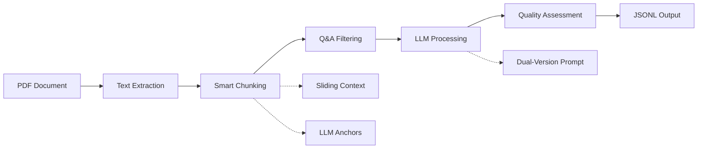

# 🔍 Legend QA Extractor

<div align="center">

[](https://www.python.org/downloads/)
[](LICENSE)
[](https://github.com/psf/black)

**Professional PDF Q&A Pair Extraction Tool Powered by Local LLMs**

*Transform your PDF documents into structured Q&A datasets for AI training and knowledge management*

[English](README_EN.md) • [中文文档](README_CN.md)

</div>

---

## ✨ Key Features

🤖 **Local LLM Integration**
- Utilizes Ollama with advanced models like Qwen2.5
- Complete local processing ensuring data privacy and security
- Support for multiple model scales, from 7B to 14B parameters

📄 **Intelligent PDF Processing**
- High-precision PDF text extraction and preprocessing
- Smart text chunking algorithm (SmartBlockProcessor)
- Adaptive block size adjustment and quality assurance

🎯 **Advanced Q&A Recognition**
- Multi-pattern Q&A format recognition (direct questions, article quotes, indirect questions, etc.)
- Intelligent dual-version prompt mechanism with automatic token optimization
- Context-aware sliding window technology

⚙️ **Flexible Configuration System**
- YAML configuration files + environment variables + command-line parameters
- Real-time configuration validation and intelligent defaults
- Complete parameter documentation and best practice guides

🔧 **Developer Friendly**
- Modular architecture, easy to extend and maintain
- Complete type hints and documentation strings
- Comprehensive unit test coverage

📊 **Quality Monitoring**
- Built-in extraction quality assessment metrics
- Detailed processing logs and error tracking
- Token usage monitoring and optimization recommendations

## 🔄 How It Works



### Processing Pipeline Details

1. **PDF Parsing**: High-quality text extraction using PyMuPDF
2. **Smart Chunking**: SmartBlockProcessor performs structured text segmentation
3. **Context Enhancement**: Sliding window and LLM-generated topic anchors
4. **Q&A Recognition**: Multi-pattern matching and intelligent filtering
5. **LLM Extraction**: Adaptive prompt selection and token optimization
6. **Quality Assurance**: Result validation and scoring mechanisms

## 🚀 Quick Start

### Prerequisites

- **Python**: 3.8 or higher
- **Ollama**: Installed and running ([Installation Guide](https://ollama.ai/))
- **Model**: Recommended `qwen2.5:7b-instruct` or higher
- **System**: macOS, Linux, or Windows

### Installation Steps

```bash
# 1. Clone the repository
git clone https://github.com/yourusername/legend-qa-extractor.git
cd legend-qa-extractor

# 2. Automatic environment setup (recommended)
chmod +x scripts/setup_environment.sh
./scripts/setup_environment.sh

# 3. Or manual setup
python -m venv venv
source venv/bin/activate  # Windows: venv\Scripts\activate
pip install -r requirements.txt

# 4. Pull recommended model
ollama pull qwen2.5:7b-instruct
```

### Basic Usage

```bash
# Extract Q&A pairs
python extract_qa.py your_document.pdf

# Quick test (process 10% of content)
python extract_qa.py document.pdf --sample 0.1

# Use custom configuration
python extract_qa.py document.pdf --config my_config.yaml

# Create configuration template
python extract_qa.py --create-config

# Validate environment setup
python extract_qa.py --validate
```

## ⚙️ Configuration System

### Configuration File Example

```yaml
# config/config.yaml
# Basic settings
pdf_filename: "document.pdf"
output_filename: "extracted_qa.jsonl"
output_dir: "output"

# Model configuration
model_name: "qwen2.5:7b-instruct"
ollama_host: "http://localhost:11434"
temperature: 0.1

# Processing parameters
max_block_size: 1500
min_block_size: 200
extract_ratio: 1.0
enable_qa_filter: false

# Advanced features
enable_sliding_context: true
enable_llm_anchor: true
anchor_keywords_count: 2

# Monitoring and logging
log_level: "INFO"
enable_token_monitoring: true
```

### Environment Variable Support

```bash
export PDF_FILENAME="your_document.pdf"
export OLLAMA_MODEL="qwen2.5:14b-instruct"
export MAX_BLOCK_SIZE=2000
export EXTRACT_RATIO=0.5
export LOG_LEVEL="DEBUG"
```

### Command Line Options

```bash
python extract_qa.py [PDF_FILE] [OPTIONS]

Main options:
  --config CONFIG           Specify YAML configuration file
  --output OUTPUT           Output JSONL file path
  --model MODEL            Ollama model name
  --sample RATIO           Sample ratio (0.0-1.0)
  --max-block-size SIZE    Maximum text block size
  --enable-qa-filter       Enable Q&A block filtering
  --temperature TEMP       Model temperature parameter
  --log-level LEVEL        Logging level
  --validate               Validate configuration only
  --create-config          Create configuration template
```

## 📁 Project Structure

```
legend-qa-extractor/
├── src/                        # Core source code
│   ├── config/                 # Configuration management
│   │   ├── __init__.py
│   │   └── settings.py         # Configuration classes and validation
│   ├── core/                   # Core processing modules
│   │   ├── pdf_processor.py    # PDF text extraction
│   │   ├── text_processor.py   # Text preprocessing and chunking
│   │   ├── qa_extractor.py     # Q&A pair extraction engine
│   │   ├── llm_client.py       # Ollama client
│   │   └── smart_block_processor.py # Smart block processor
│   ├── utils/                  # Utility functions
│   │   ├── file_utils.py       # File operations
│   │   └── logger.py           # Logging system
│   └── processor.py            # Main processing pipeline
├── config/                     # Configuration files
│   └── config.yaml            # Default configuration
├── docs/                       # Documentation
│   ├── PROMPT_SELECTION_GUIDE.md
│   └── TOKEN_OPTIMIZATION_GUIDE.md
├── examples/                   # Usage examples
├── tests/                      # Test suite
├── scripts/                    # Utility scripts
├── extract_qa.py              # CLI entry point
└── output/                    # Output directory
```

## 🎯 Usage Examples

### Command Line Usage

```bash
# Basic extraction
python extract_qa.py interview.pdf

# High-quality extraction (using larger model)
python extract_qa.py document.pdf \
  --model qwen2.5:14b-instruct \
  --temperature 0.05 \
  --enable-qa-filter

# Batch testing
python extract_qa.py large_document.pdf \
  --sample 0.2 \
  --max-block-size 2000 \
  --output test_results.jsonl
```

### Programmatic Interface

```python
from src.config import Config
from src.processor import QAExtractionProcessor

# Create configuration
config = Config()
config.pdf_filename = "document.pdf"
config.model_name = "qwen2.5:7b-instruct"
config.enable_sliding_context = True
config.enable_llm_anchor = True

# Initialize processor
processor = QAExtractionProcessor(config)

# Validate environment
validation = processor.validate_setup()
if validation['valid']:
    # Process document
    results = processor.process_pdf()
    print(f"Extracted {results['stats']['qa_pairs_extracted']} Q&A pairs")
    print(f"Output file: {results['output_path']}")
else:
    print("Environment validation failed:", validation['issues'])
```

### Custom Configuration Examples

```python
# Optimized configuration for interview transcripts
config = Config()
config.known_prefixes = ["Interviewer", "Candidate", "Host", "Guest"]
config.max_block_size = 2500
config.enable_qa_filter = True
config.temperature = 0.02
config.enable_sliding_context = True

# Configuration for academic papers
config = Config()
config.known_prefixes = ["Question", "Answer", "Q", "A"]
config.max_block_size = 1200
config.enable_llm_anchor = True
config.anchor_keywords_count = 3
```

## 📊 Output Format

The tool generates structured JSONL format files with one Q&A pair per line:

```json
{
  "question": "What are the core principles of value investing?",
  "answer": "The core principle of value investing is that buying stocks means buying companies. When you purchase a company's stock, you're actually buying a portion of ownership in that company. Therefore, it's important to understand the business model, financial condition, and long-term prospects of that company.",
  "source_text": "User: What are the core principles of value investing?\nExpert: The core principle of value investing is that buying stocks means buying companies..."
}
```

### Quality Metrics

Quality reports are generated after each processing:

```json
{
  "extraction_quality": {
    "total_blocks_processed": 45,
    "qa_pairs_extracted": 28,
    "extraction_rate": 0.62,
    "average_question_length": 15.2,
    "average_answer_length": 125.8,
    "quality_score": 8.7
  }
}
```

## 🔧 Advanced Features

### Intelligent Prompt Selection

The system automatically selects the most appropriate prompt version based on text length:

- **Full Version**: Detailed extraction rules and examples (used when ≤1500 characters)
- **Compact Version**: Core instructions to save token space (used when >1500 characters)

### Smart Text Chunking

SmartBlockProcessor provides four-layer processing strategy:

1. **Structural Chunking**: Based on paragraphs, headings, and Q&A markers
2. **Adaptive Merging**: Intelligently merge small blocks to optimize processing efficiency
3. **Quality Assurance**: Filter invalid blocks to ensure processing quality
4. **Metadata Enhancement**: Generate context and topic anchors

### Token Monitoring

Real-time monitoring and optimization of token usage:

```bash
📊 Token Usage Report
==================================================
📝 Prompt Usage Statistics:
   Compact version: 15 times (60%)
   Full version: 10 times (40%)
🎯 Token Usage Statistics:
   Average utilization: 68.5%
   Maximum usage: 3,245 tokens
   Minimum usage: 1,892 tokens
⚡ Performance Metrics:
   Processing speed: 2.3 blocks/minute
   Average response time: 8.7 seconds
🟢 Token utilization is healthy
```

## 🛠️ Development Guide

### Setting Up Development Environment

```bash
# Install development dependencies
pip install -r requirements-dev.txt

# Set up pre-commit hooks
pre-commit install

# Run tests
pytest tests/ -v --cov=src

# Code formatting
black src/ tests/
isort src/ tests/

# Type checking
mypy src/
```

### Running Tests

```bash
# Basic tests
pytest tests/

# With coverage report
pytest tests/ --cov=src --cov-report=html

# Run only fast tests
pytest tests/ -m "not slow"

# Integration tests
pytest tests/ -m integration
```

### Custom Extensions

The project uses modular design for easy extension:

```python
# Custom text processor
class CustomTextProcessor(TextProcessor):
    def preprocess_qa_text(self, text: str) -> str:
        # Add custom preprocessing logic
        return super().preprocess_qa_text(text)

# Custom Q&A extractor  
class CustomQAExtractor(QAExtractor):
    def create_prompt(self, text_block: str) -> str:
        # Custom prompt generation logic
        return f"Custom instruction:\n{text_block}"
```

## 📚 Documentation Resources

- **[Prompt Selection Guide](docs/PROMPT_SELECTION_GUIDE.md)**: Detailed explanation of prompt mechanisms
- **[Token Optimization Guide](docs/TOKEN_OPTIMIZATION_GUIDE.md)**: Token usage optimization techniques
- **[API Documentation](docs/api.md)**: Complete API reference

## 🔍 Troubleshooting

### Common Issues

**Q: Ollama connection failed**
```bash
# Check Ollama service status
ollama list
curl http://localhost:11434/api/tags

# Restart Ollama service
ollama stop && ollama start
```

**Q: Slow model download**
```bash
# Use mirror acceleration
export OLLAMA_HOST=https://your-mirror.com
ollama pull qwen2.5:7b-instruct
```

**Q: Out of memory**
```bash
# Reduce block size and sampling ratio
python extract_qa.py document.pdf --max-block-size 800 --sample 0.5
```

**Q: Poor extraction quality**
```bash
# Enable high-quality mode
python extract_qa.py document.pdf \
  --model qwen2.5:14b-instruct \
  --temperature 0.05 \
  --enable-qa-filter \
  --enable-sliding-context
```

### Log Analysis

Enable detailed logging to diagnose issues:

```bash
python extract_qa.py document.pdf --log-level DEBUG
```

Check log files in the output directory:
- `main.log`: Main processing logs
- `extraction_success_final.log`: Successful extraction records
- `extraction_errors_final.log`: Errors and warnings

## 🤝 Contributing Guide

We welcome community contributions! Please follow these steps:

1. **Fork** the project to your GitHub account
2. **Create** a feature branch: `git checkout -b feature/amazing-feature`
3. **Commit** your changes: `git commit -m 'Add amazing feature'`
4. **Push** to the branch: `git push origin feature/amazing-feature`
5. **Create** a Pull Request

### Contribution Types

- 🐛 Bug fixes
- ✨ New features
- 📚 Documentation improvements
- 🧪 Test cases
- 🎨 Code optimization

### Development Standards

- Follow PEP 8 code style
- Add appropriate type hints
- Write unit tests
- Update relevant documentation

## 📄 License

This project is licensed under the [MIT License](LICENSE).

```
MIT License

Copyright (c) 2025 souflex56

Permission is hereby granted, free of charge, to any person obtaining a copy
of this software and associated documentation files (the "Software"), to deal
in the Software without restriction, including without limitation the rights
to use, copy, modify, merge, publish, distribute, sublicense, and/or sell
copies of the Software, and to permit persons to whom the Software is
furnished to do so, subject to the following conditions:

The above copyright notice and this permission notice shall be included in all
copies or substantial portions of the Software.
```

## 🙏 Acknowledgments

- **Ollama Team**: For providing excellent local LLM services
- **Qwen Team**: For providing high-quality Chinese language models
- **PyMuPDF**: For powerful PDF processing capabilities
- **Open Source Community**: For maintaining various dependency libraries

## 📞 Support & Contact

- **GitHub Issues**: [Report Issues](https://github.com/yourusername/legend-qa-extractor/issues)
- **GitHub Discussions**: [Technical Discussions](https://github.com/yourusername/legend-qa-extractor/discussions)
- **Email**: support@legendqa.com

---

<div align="center">

**⭐ If this project helps you, please give us a Star!**

[⬆ Back to Top](#-legend-qa-extractor)

</div>


