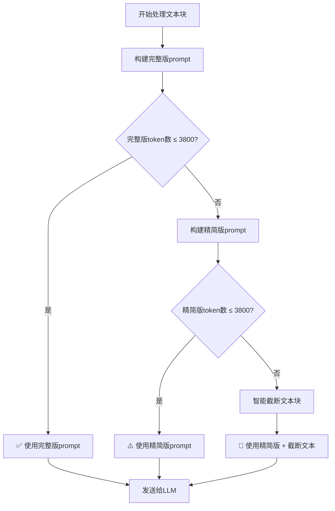

# Prompt选择机制详解

## 系统概述

QA提取系统使用**智能双版本prompt机制**，根据token使用情况自动选择最适合的prompt版本，确保在token限制内获得最佳的提取质量。

## Prompt版本对比

### 📏 基础信息

| 版本 | Token数 | 字符数 | 用途 |
|------|---------|---------|------|
| **精简版** | 255 tokens | 227 字符 | Token紧张时使用 |
| **完整版** | 1195 tokens | 995 字符 | 正常情况下使用 |

### 📋 内容差异

#### 精简版 (Compact Prompt)
```
你是问答对提取专家。从原文中提取段永平的所有问答对。

提取规则：
1. 问题：网友、问、观众、主持人、文章引用、有人说/认为等引出的内容
2. 答案：仅限段永平、段、大道的回答
3. 格式：JSON数组 [{"question": "问题", "answer": "答案"}]

示例：
网友：什么是价值投资？
段：买股票就是买公司。

输出：[{"question": "什么是价值投资？", "answer": "买股票就是买公司。"}]

原文：
```

#### 完整版 (Full Prompt)
```
你是一个专业的中文问答对提取专家。请从给定的原文中提取**所有**有效的问答对。

🎯 核心任务：
1. 识别所有形式的提问或话题引入
2. 匹配对应的段永平回答
3. 确保问答配对准确完整

📋 提取规则：
1. **问题来源**（多种形式）：
   - 直接提问：网友、问、观众、主持人、Q等开头
   - 文章引用：文章引用、引用、有人说等引出的观点或问题
   - 间接提问：通过描述、举例引出的问题
   - 话题讨论：任何引发段永平回应的内容

2. **答案来源**：仅限段永平、段、大道的回答（排除方丈、其他人）

3. **配对原则**：
   - 一个问题/话题对应一个段永平的回答
   - 问题可以是直接提问，也可以是引用、描述等形式
   - 保持问题和答案的完整性和上下文

4. **输出格式**：JSON数组 [{"question": "问题或话题", "answer": "段永平的回答"}]

❌ 不要提取的内容：...
✅ 提取示例：...

🔍 请仔细分析以下原文，识别所有引发段永平回应的内容（包括直接提问、文章引用、描述等），并提取所有符合条件的问答对：
```

## 🤖 选择逻辑

### 决策流程



### 具体判断条件

1. **优先使用完整版**
   ```python
   if (完整版prompt + 上下文 + 文本块) ≤ 3800 tokens:
       使用完整版prompt
   ```

2. **降级为精简版**
   ```python
   elif (精简版prompt + 上下文 + 文本块) ≤ 3800 tokens:
       使用精简版prompt
   ```

3. **需要截断处理**
   ```python
   else:
       截断文本块或移除上下文信息
       使用精简版prompt
   ```

## 📊 实际测试数据

基于当前配置 (`max_prompt_tokens: 3800`) 的测试结果：

| 文本块大小 | 完整版tokens | 精简版tokens | 选择 | 说明 |
|-----------|-------------|-------------|------|------|
| 300字符   | 1647        | 706         | **完整版** | ✅ 不超限 |
| 600字符   | 2097        | 1156        | **完整版** | ✅ 不超限 |
| 1000字符  | 2697        | 1756        | **完整版** | ✅ 不超限 |
| 1500字符  | 3447        | 2506        | **完整版** | ✅ 不超限 |
| 2000字符  | 4197        | 3256        | **精简版** | ⚠️ 完整版超限 |

### 📈 切换点分析

- **完整版安全范围**：文本块 ≤ 1500字符
- **精简版启用点**：文本块 > 1500字符
- **截断触发点**：文本块 > 2400字符（精简版也超限）

## 💡 优势分析

### 完整版prompt的优势
- **详细指导**：包含完整的提取规则和示例
- **高准确性**：详细说明确保LLM理解复杂场景
- **多样化支持**：支持各种问题形式（直接提问、文章引用、描述引出等）

### 精简版prompt的优势
- **节省空间**：为更多文本内容预留token空间
- **高效处理**：在token受限时仍能保持基本功能
- **快速响应**：减少prompt处理时间

## 🔧 配置调优

### 影响prompt选择的配置参数

```yaml
# 核心参数
max_prompt_tokens: 3800      # Token上限（影响选择阈值）
max_block_size: 1000         # 文本块大小（影响token使用）
enable_sliding_context: false # 上下文（增加token消耗）
enable_llm_anchor: false     # 锚点（增加token消耗）
```

### 优化建议

#### 希望更多使用完整版prompt
```yaml
max_prompt_tokens: 4500      # 增加token限制
max_block_size: 800          # 减少文本块大小
enable_sliding_context: false # 关闭额外功能
```

#### 希望节省token使用
```yaml
max_prompt_tokens: 3500      # 减少token限制
max_block_size: 1500         # 可以适当增加文本块
enable_sliding_context: true # 可以启用高级功能
```

## 📋 监控和调试

### 查看prompt选择日志

启用DEBUG日志级别：
```yaml
log_level: DEBUG
```

关键日志信息：
```
# 使用完整版
DEBUG - Using full prompt, estimated tokens: 2847

# 降级为精简版
DEBUG - Using compact prompt, estimated tokens: 1245

# 需要截断
WARNING - Text block truncated to 800 chars due to token limit
```

### 自动监控报告

处理完成后查看token使用总结：
```
📊 Token使用总结报告
==================================================
📝 Prompt使用统计:
   精简版: 15 次
   完整版: 10 次
🎯 Token使用统计:
   平均利用率: 45.2%
🟢 Token利用率健康
```

## 🎯 最佳实践

1. **保持默认配置**：当前配置已经过优化，适合大多数场景
2. **监控使用情况**：定期查看prompt使用统计，了解实际分布
3. **根据文档调整**：不同类型文档可能需要不同的配置策略
4. **质量优先**：如果提取质量下降，优先考虑增加token限制而非减少文本块大小

通过这套智能prompt选择机制，系统能够在保证不出现截断的前提下，最大化利用可用的token空间，确保最佳的QA提取效果。 