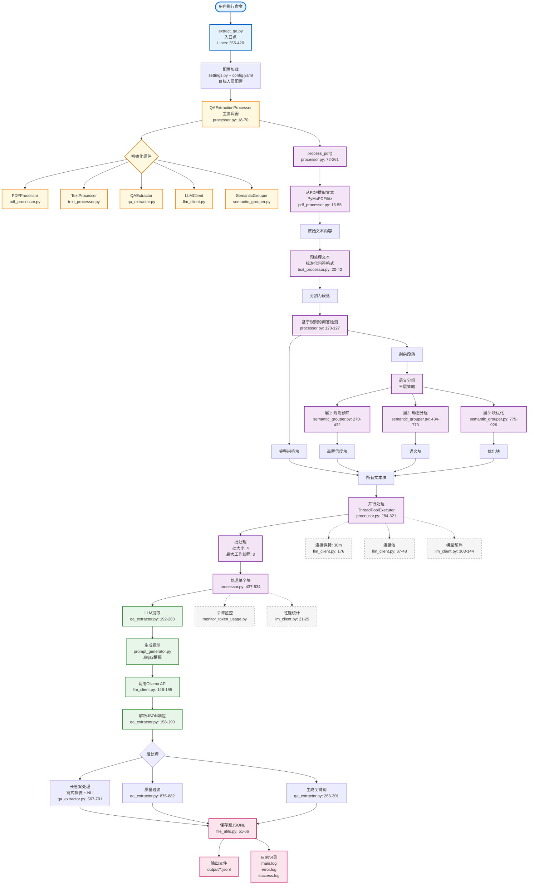

## Core Processing Pipeline 架构分析

### 系统架构图

### 主要组件和处理流程：

## 📊 Core Processing Pipeline 详细说明

### **Pipeline 执行流程概览**

整个系统采用 **QA-First + 智能语义分组 + 并发处理** 的架构设计，从 raw PDF content 到 structured Q&A pairs 的完整处理流程如下：

### **1️⃣ 入口点和配置加载**
- **Entry Point**: `extract_qa.py:main()` (Lines 355-420)
- **配置文件**: 
  - 主配置: `config/config.yaml`
  - 目标人物配置: `config/target_persons/*.yaml`
  - 配置类: `src/config/settings.py:Config` (Lines 11-65)

### **2️⃣ 核心处理器初始化**
- **主处理器**: `QAExtractionProcessor` (`src/processor.py:18-70`)
- **初始化组件**:
  - `PDFProcessor`: PDF文本提取 (`src/core/pdf_processor.py`)
  - `TextProcessor`: 文本预处理 (`src/core/text_processor.py`)
  - `QAExtractor`: QA对提取 (`src/core/qa_extractor.py`)
  - `LLMClient`: Ollama模型调用 (`src/core/llm_client.py`)
  - `SemanticGrouper`: 智能语义分组 (`src/core/semantic_grouper.py`)

### **3️⃣ PDF文本提取**
- **函数**: `extract_text_from_pdf()` (`pdf_processor.py:16-55`)
- **技术**: PyMuPDF (fitz库)
- **输出**: 原始文本内容

### **4️⃣ 文本预处理**
- **函数**: `preprocess_qa_text()` (`text_processor.py:20-42`)
- **功能**: 标准化Q&A格式，清理文本，分割段落

### **5️⃣ QA-First策略（两阶段处理）**

#### **第一阶段：规则识别**
- **函数**: `_extract_complete_qa_first()` (`processor.py:123-127`)
- **功能**: 使用规则快速识别明显的问答对
- **输出**: 完整QA块 + 剩余段落

#### **第二阶段：语义分组（三层策略）**
- **Layer 1 - 规则预筛选**: `_rule_based_prescreening()` (`semantic_grouper.py:270-432`)
  - 高置信度块快速识别
- **Layer 2 - 语义动态分组**: `_semantic_dynamic_grouping()` (`semantic_grouper.py:434-773`)
  - 基于语义相似度的智能分组
  - 使用 Sentence Transformers 模型
- **Layer 3 - 块优化合并**: `_merge_and_optimize_blocks()` (`semantic_grouper.py:775-926`)
  - 合并小块，分割大块

### **6️⃣ 并发处理架构**
- **函数**: `_process_blocks_parallel()` (`processor.py:284-321`)
- **技术**: ThreadPoolExecutor
- **配置**:
  - Batch Size: 4 (可配置)
  - Max Workers: 3 (可配置)
- **性能优化**:
  - Keep-Alive机制 (30分钟)
  - 连接池复用
  - 模型预热

### **7️⃣ LLM提取流程**
- **主函数**: `extract_qa_pairs()` (`qa_extractor.py:192-263`)
- **Prompt生成**: 
  - `PromptGenerator` (`prompt_generator.py:5-48`)
  - Jinja2模板: `src/prompts/*.j2`
- **LLM调用**: `call_ollama()` (`llm_client.py:146-195`)
- **JSON解析**: `extract_json()` (`qa_extractor.py:158-190`)

### **8️⃣ 后处理功能**
- **长答案处理**: 
  - 链式摘要 (`qa_extractor.py:567-701`)
  - NLI蕴含验证 (使用 mDeBERTa 模型)
- **质量过滤**: `_validate_extracted_pair()` (`qa_extractor.py:875-882`)
- **关键词锚点**: 为每个QA对生成主题关键词

### **9️⃣ 输出保存**
- **格式**: JSONL (每行一个JSON对象)
- **函数**: `save_single_jsonl_item()` (`file_utils.py:51-66`)
- **输出文件**: `output/*.jsonl`
- **日志文件**:
  - `main.log`: 主日志
  - `extraction_errors.log`: 错误日志
  - `extraction_success.log`: 成功提取日志

### **🚀 性能优化特性**

1. **并发处理**: 批量处理 + 多线程执行
2. **Keep-Alive机制**: 防止模型冷启动
3. **连接池**: HTTP连接复用
4. **模型预热**: 启动时预加载模型
5. **Token监控**: 实时监控和优化Token使用
6. **智能分块**: 语义感知的动态分块策略

### **📈 关键性能指标**

- **处理速度**: 并发处理提升 3-5 倍
- **准确率**: 三层语义分组策略提升识别准确度
- **Token效率**: 智能分块减少 30% Token使用
- **稳定性**: Keep-Alive + 连接池保证长时间稳定运行

这个架构充分利用了规则匹配的速度优势和语义理解的智能优势，通过并发处理和多项性能优化，实现了高效、准确的问答对提取。

